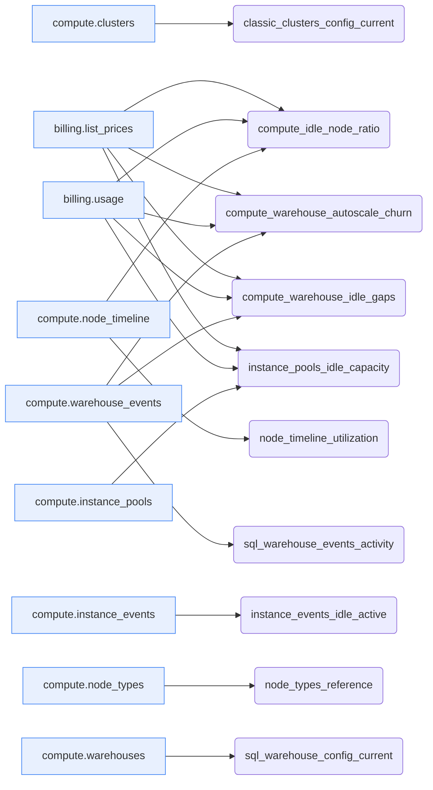
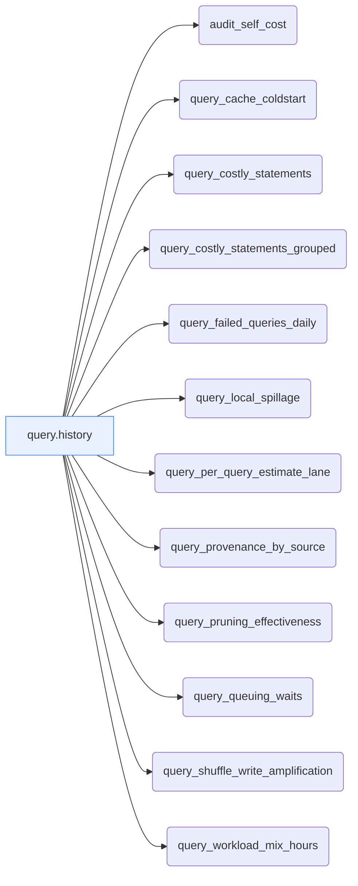
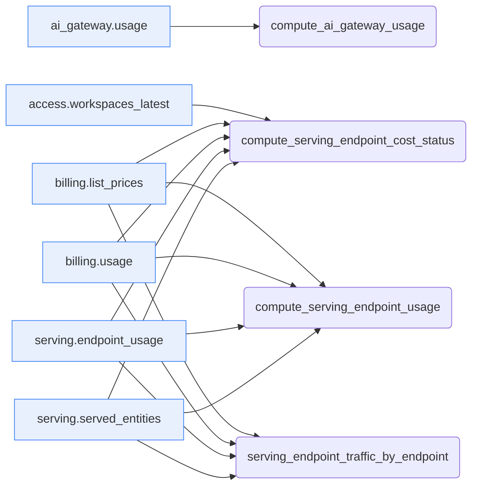
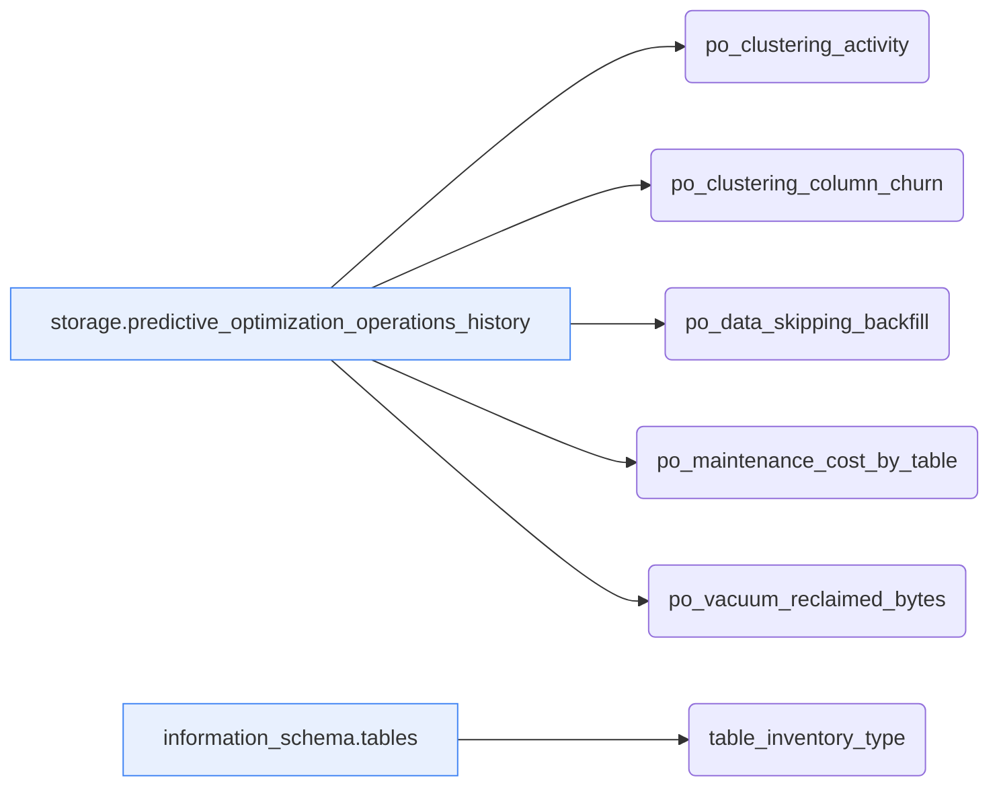
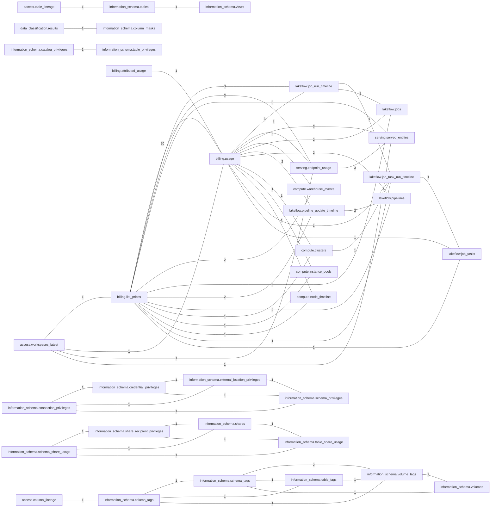

# Query lineage (dbt-style)

Derived **purely from the queries** and the `system.*` tables their `reads:` headers declare — no external data. Each query is a dbt-style *model*; each `system.*` table is a *source* ([`sources.yml`](sources.yml)). Machine-readable: [`query_lineage.json`](query_lineage.json).

**100 queries → 47 distinct system-table sources.**

## Most-read sources

| System table | # queries |
|---|--:|
| `system.billing.usage` | 35 |
| `system.billing.list_prices` | 22 |
| `system.query.history` | 12 |
| `system.lakeflow.job_run_timeline` | 11 |
| `system.storage.predictive_optimization_operations_history` | 5 |
| `system.access.audit` | 4 |
| `system.lakeflow.jobs` | 4 |
| `system.compute.warehouse_events` | 3 |
| `system.information_schema.tables` | 3 |
| `system.information_schema.volume_tags` | 3 |
| `system.lakeflow.job_task_run_timeline` | 3 |
| `system.lakeflow.pipeline_update_timeline` | 3 |
| `system.lakeflow.pipelines` | 3 |
| `system.serving.endpoint_usage` | 3 |
| `system.serving.served_entities` | 3 |

## Lineage graphs (sources → queries), by domain

### compute

### cost

```mermaid
graph LR
  system_billing_list_prices["billing.list_prices"]:::src
  system_billing_list_prices --> cost__cost_account_prices_raw("cost_account_prices_raw")
  system_billing_list_prices --> cost__cost_actual_vs_list_by_sku("cost_actual_vs_list_by_sku")
  system_billing_usage["billing.usage"]:::src
  system_billing_usage --> cost__cost_actual_vs_list_by_sku("cost_actual_vs_list_by_sku")
  system_billing_usage --> cost__cost_by_billing_origin_product("cost_by_billing_origin_product")
  system_billing_usage --> cost__cost_by_compute_resource("cost_by_compute_resource")
  system_billing_usage --> cost__cost_by_job("cost_by_job")
  system_billing_usage --> cost__cost_by_notebook("cost_by_notebook")
  system_billing_usage --> cost__cost_by_serving_endpoint("cost_by_serving_endpoint")
  system_billing_usage --> cost__cost_chargeback_by_identity("cost_chargeback_by_identity")
  system_billing_usage --> cost__cost_chargeback_by_tag("cost_chargeback_by_tag")
  system_billing_list_prices --> cost__cost_cloud_infra("cost_cloud_infra")
  system_billing_usage --> cost__cost_cloud_infra("cost_cloud_infra")
  system_billing_attributed_usage["billing.attributed_usage"]:::src
  system_billing_attributed_usage --> cost__cost_dbsql_allocation_gap("cost_dbsql_allocation_gap")
  system_billing_usage --> cost__cost_dbsql_allocation_gap("cost_dbsql_allocation_gap")
  system_billing_usage --> cost__cost_default_storage_dsu("cost_default_storage_dsu")
  system_billing_list_prices --> cost__cost_dollarized_by_sku_day("cost_dollarized_by_sku_day")
  system_billing_usage --> cost__cost_dollarized_by_sku_day("cost_dollarized_by_sku_day")
  system_billing_usage --> cost__cost_genai_token_gpu("cost_genai_token_gpu")
  system_billing_usage --> cost__cost_networking_egress("cost_networking_egress")
  system_billing_usage --> cost__cost_premium_serverless_photon("cost_premium_serverless_photon")
  system_billing_usage --> cost__cost_restatement_trust_metric("cost_restatement_trust_metric")
  system_billing_list_prices --> cost__cost_serving_mode_by_endpoint("cost_serving_mode_by_endpoint")
  system_billing_usage --> cost__cost_serving_mode_by_endpoint("cost_serving_mode_by_endpoint")
  system_billing_usage --> cost__cost_totals_by_sku_day("cost_totals_by_sku_day")
  system_billing_usage --> cost__cost_usage_policy_coverage("cost_usage_policy_coverage")
  system_billing_list_prices --> cost__cost_vector_search_spend("cost_vector_search_spend")
  system_billing_usage --> cost__cost_vector_search_spend("cost_vector_search_spend")
  system_access_workspaces_latest["access.workspaces_latest"]:::src
  system_access_workspaces_latest --> cost__cost_workspace_names("cost_workspace_names")
  system_billing_list_prices --> cost__pricing_list_prices_raw("pricing_list_prices_raw")
  classDef src fill:#e8f0fe,stroke:#4285f4;
```

### governance_access

```mermaid
graph LR
  system_access_audit["access.audit"]:::src
  system_access_audit --> governance_access__access_admin_role_change_events("access_admin_role_change_events")
  system_data_classification_results["data_classification.results"]:::src
  system_data_classification_results --> governance_access__access_classified_unmasked("access_classified_unmasked")
  system_information_schema_column_masks["information_schema.column_masks"]:::src
  system_information_schema_column_masks --> governance_access__access_classified_unmasked("access_classified_unmasked")
  system_access_column_lineage["access.column_lineage"]:::src
  system_access_column_lineage --> governance_access__access_column_lineage_sensitive_reach("access_column_lineage_sensitive_reach")
  system_information_schema_column_masks --> governance_access__access_column_masks_inventory("access_column_masks_inventory")
  system_data_classification_results --> governance_access__access_data_classification_inventory("access_data_classification_inventory")
  system_access_table_lineage["access.table_lineage"]:::src
  system_access_table_lineage --> governance_access__access_dead_table_candidates("access_dead_table_candidates")
  system_information_schema_tables["information_schema.tables"]:::src
  system_information_schema_tables --> governance_access__access_dead_table_candidates("access_dead_table_candidates")
  system_information_schema_schema_share_usage["information_schema.schema_share_usage"]:::src
  system_information_schema_schema_share_usage --> governance_access__access_delta_sharing_exposure("access_delta_sharing_exposure")
  system_information_schema_share_recipient_privileges["information_schema.share_recipient_privileges"]:::src
  system_information_schema_share_recipient_privileges --> governance_access__access_delta_sharing_exposure("access_delta_sharing_exposure")
  system_information_schema_shares["information_schema.shares"]:::src
  system_information_schema_shares --> governance_access__access_delta_sharing_exposure("access_delta_sharing_exposure")
  system_information_schema_table_share_usage["information_schema.table_share_usage"]:::src
  system_information_schema_table_share_usage --> governance_access__access_delta_sharing_exposure("access_delta_sharing_exposure")
  system_information_schema_catalog_privileges["information_schema.catalog_privileges"]:::src
  system_information_schema_catalog_privileges --> governance_access__access_grants_inventory("access_grants_inventory")
  system_information_schema_table_privileges["information_schema.table_privileges"]:::src
  system_information_schema_table_privileges --> governance_access__access_grants_inventory("access_grants_inventory")
  system_information_schema_connection_privileges["information_schema.connection_privileges"]:::src
  system_information_schema_connection_privileges --> governance_access__access_grants_inventory_extended("access_grants_inventory_extended")
  system_information_schema_credential_privileges["information_schema.credential_privileges"]:::src
  system_information_schema_credential_privileges --> governance_access__access_grants_inventory_extended("access_grants_inventory_extended")
  system_information_schema_external_location_privileges["information_schema.external_location_privileges"]:::src
  system_information_schema_external_location_privileges --> governance_access__access_grants_inventory_extended("access_grants_inventory_extended")
  system_information_schema_schema_privileges["information_schema.schema_privileges"]:::src
  system_information_schema_schema_privileges --> governance_access__access_grants_inventory_extended("access_grants_inventory_extended")
  system_access_audit --> governance_access__access_login_concentration("access_login_concentration")
  system_access_inbound_network["access.inbound_network"]:::src
  system_access_inbound_network --> governance_access__access_network_inbound_denials("access_network_inbound_denials")
  system_access_outbound_network["access.outbound_network"]:::src
  system_access_outbound_network --> governance_access__access_network_outbound_denials("access_network_outbound_denials")
  system_information_schema_schema_tags["information_schema.schema_tags"]:::src
  system_information_schema_schema_tags --> governance_access__access_pii_outside_tables("access_pii_outside_tables")
  system_information_schema_volume_tags["information_schema.volume_tags"]:::src
  system_information_schema_volume_tags --> governance_access__access_pii_outside_tables("access_pii_outside_tables")
  system_information_schema_volumes["information_schema.volumes"]:::src
  system_information_schema_volumes --> governance_access__access_pii_outside_tables("access_pii_outside_tables")
  system_access_column_lineage --> governance_access__access_pii_propagation_untagged("access_pii_propagation_untagged")
  system_information_schema_column_tags["information_schema.column_tags"]:::src
  system_information_schema_column_tags --> governance_access__access_pii_propagation_untagged("access_pii_propagation_untagged")
  system_information_schema_row_filters["information_schema.row_filters"]:::src
  system_information_schema_row_filters --> governance_access__access_row_filters_inventory("access_row_filters_inventory")
  system_access_audit --> governance_access__access_runas_escalation("access_runas_escalation")
  system_access_table_lineage --> governance_access__access_table_lineage_blast_radius("access_table_lineage_blast_radius")
  system_information_schema_column_tags --> governance_access__access_tags_inventory("access_tags_inventory")
  system_information_schema_schema_tags --> governance_access__access_tags_inventory("access_tags_inventory")
  system_information_schema_table_tags["information_schema.table_tags"]:::src
  system_information_schema_table_tags --> governance_access__access_tags_inventory("access_tags_inventory")
  system_information_schema_volume_tags --> governance_access__access_tags_inventory("access_tags_inventory")
  system_access_audit --> governance_access__access_vector_search_traffic("access_vector_search_traffic")
  system_information_schema_tables --> governance_access__access_views_inventory("access_views_inventory")
  system_information_schema_views["information_schema.views"]:::src
  system_information_schema_views --> governance_access__access_views_inventory("access_views_inventory")
  system_information_schema_volume_tags --> governance_access__access_volumes_inventory("access_volumes_inventory")
  system_information_schema_volumes --> governance_access__access_volumes_inventory("access_volumes_inventory")
  classDef src fill:#e8f0fe,stroke:#4285f4;
```

### jobs_pipelines

```mermaid
graph LR
  system_billing_list_prices["billing.list_prices"]:::src
  system_billing_list_prices --> jobs_pipelines__lakeflow_failed_jobs_wasted_dbus("lakeflow_failed_jobs_wasted_dbus")
  system_billing_usage["billing.usage"]:::src
  system_billing_usage --> jobs_pipelines__lakeflow_failed_jobs_wasted_dbus("lakeflow_failed_jobs_wasted_dbus")
  system_lakeflow_job_run_timeline["lakeflow.job_run_timeline"]:::src
  system_lakeflow_job_run_timeline --> jobs_pipelines__lakeflow_failed_jobs_wasted_dbus("lakeflow_failed_jobs_wasted_dbus")
  system_lakeflow_job_run_timeline --> jobs_pipelines__lakeflow_failed_runs("lakeflow_failed_runs")
  system_lakeflow_jobs["lakeflow.jobs"]:::src
  system_lakeflow_jobs --> jobs_pipelines__lakeflow_health_rule_coverage("lakeflow_health_rule_coverage")
  system_lakeflow_jobs --> jobs_pipelines__lakeflow_job_ownership_orphans("lakeflow_job_ownership_orphans")
  system_lakeflow_job_run_timeline --> jobs_pipelines__lakeflow_job_queue_time("lakeflow_job_queue_time")
  system_billing_list_prices --> jobs_pipelines__lakeflow_job_tasks_no_timeout("lakeflow_job_tasks_no_timeout")
  system_billing_usage --> jobs_pipelines__lakeflow_job_tasks_no_timeout("lakeflow_job_tasks_no_timeout")
  system_lakeflow_job_tasks["lakeflow.job_tasks"]:::src
  system_lakeflow_job_tasks --> jobs_pipelines__lakeflow_job_tasks_no_timeout("lakeflow_job_tasks_no_timeout")
  system_billing_list_prices --> jobs_pipelines__lakeflow_jobs_no_timeout("lakeflow_jobs_no_timeout")
  system_billing_usage --> jobs_pipelines__lakeflow_jobs_no_timeout("lakeflow_jobs_no_timeout")
  system_lakeflow_jobs --> jobs_pipelines__lakeflow_jobs_no_timeout("lakeflow_jobs_no_timeout")
  system_billing_list_prices --> jobs_pipelines__lakeflow_jobs_on_all_purpose("lakeflow_jobs_on_all_purpose")
  system_billing_usage --> jobs_pipelines__lakeflow_jobs_on_all_purpose("lakeflow_jobs_on_all_purpose")
  system_compute_clusters["compute.clusters"]:::src
  system_compute_clusters --> jobs_pipelines__lakeflow_jobs_on_all_purpose("lakeflow_jobs_on_all_purpose")
  system_lakeflow_job_task_run_timeline["lakeflow.job_task_run_timeline"]:::src
  system_lakeflow_job_task_run_timeline --> jobs_pipelines__lakeflow_jobs_on_all_purpose("lakeflow_jobs_on_all_purpose")
  system_lakeflow_job_run_timeline --> jobs_pipelines__lakeflow_never_started_runs("lakeflow_never_started_runs")
  system_lakeflow_job_run_timeline --> jobs_pipelines__lakeflow_phase_cold_start("lakeflow_phase_cold_start")
  system_billing_list_prices --> jobs_pipelines__lakeflow_pipeline_cost("lakeflow_pipeline_cost")
  system_billing_usage --> jobs_pipelines__lakeflow_pipeline_cost("lakeflow_pipeline_cost")
  system_lakeflow_pipeline_update_timeline["lakeflow.pipeline_update_timeline"]:::src
  system_lakeflow_pipeline_update_timeline --> jobs_pipelines__lakeflow_pipeline_cost("lakeflow_pipeline_cost")
  system_lakeflow_pipelines["lakeflow.pipelines"]:::src
  system_lakeflow_pipelines --> jobs_pipelines__lakeflow_pipeline_cost("lakeflow_pipeline_cost")
  system_billing_list_prices --> jobs_pipelines__lakeflow_pipeline_idle_tail_duration("lakeflow_pipeline_idle_tail_duration")
  system_billing_usage --> jobs_pipelines__lakeflow_pipeline_idle_tail_duration("lakeflow_pipeline_idle_tail_duration")
  system_lakeflow_pipeline_update_timeline --> jobs_pipelines__lakeflow_pipeline_idle_tail_duration("lakeflow_pipeline_idle_tail_duration")
  system_lakeflow_pipelines --> jobs_pipelines__lakeflow_pipeline_idle_tail_duration("lakeflow_pipeline_idle_tail_duration")
  system_lakeflow_pipeline_update_timeline --> jobs_pipelines__lakeflow_pipeline_update_failures_retries("lakeflow_pipeline_update_failures_retries")
  system_lakeflow_pipelines --> jobs_pipelines__lakeflow_pipelines_inventory_tier("lakeflow_pipelines_inventory_tier")
  system_billing_list_prices --> jobs_pipelines__lakeflow_retries_repairs("lakeflow_retries_repairs")
  system_billing_usage --> jobs_pipelines__lakeflow_retries_repairs("lakeflow_retries_repairs")
  system_lakeflow_job_run_timeline --> jobs_pipelines__lakeflow_retries_repairs("lakeflow_retries_repairs")
  system_billing_list_prices --> jobs_pipelines__lakeflow_stale_zombie_jobs("lakeflow_stale_zombie_jobs")
  system_billing_usage --> jobs_pipelines__lakeflow_stale_zombie_jobs("lakeflow_stale_zombie_jobs")
  system_lakeflow_job_run_timeline --> jobs_pipelines__lakeflow_stale_zombie_jobs("lakeflow_stale_zombie_jobs")
  system_lakeflow_jobs --> jobs_pipelines__lakeflow_stale_zombie_jobs("lakeflow_stale_zombie_jobs")
  system_lakeflow_job_run_timeline --> jobs_pipelines__lakeflow_succeeded_with_failed_tasks("lakeflow_succeeded_with_failed_tasks")
  system_lakeflow_job_task_run_timeline --> jobs_pipelines__lakeflow_succeeded_with_failed_tasks("lakeflow_succeeded_with_failed_tasks")
  system_lakeflow_job_task_run_timeline --> jobs_pipelines__lakeflow_tasks_near_timeout("lakeflow_tasks_near_timeout")
  system_lakeflow_job_tasks --> jobs_pipelines__lakeflow_tasks_near_timeout("lakeflow_tasks_near_timeout")
  system_lakeflow_job_run_timeline --> jobs_pipelines__lakeflow_termination_taxonomy("lakeflow_termination_taxonomy")
  system_lakeflow_job_run_timeline --> jobs_pipelines__lakeflow_termination_type_probe("lakeflow_termination_type_probe")
  system_lakeflow_job_run_timeline --> jobs_pipelines__lakeflow_workload_mix_hours("lakeflow_workload_mix_hours")
  classDef src fill:#e8f0fe,stroke:#4285f4;
```

### performance

### serving_ai

### storage

## System-table join graph (co-read in the same query)

Undirected edges = two system tables read together in at least one query (label = how many). This is the closest thing to *system-table lineage* the queries express — they don't move data between system tables, they **join** them.

## Reverse index — which queries read each source

| System table | Queries |
|---|---|
| `system.access.audit` | `access_admin_role_change_events`, `access_login_concentration`, `access_runas_escalation`, `access_vector_search_traffic` |
| `system.access.column_lineage` | `access_column_lineage_sensitive_reach`, `access_pii_propagation_untagged` |
| `system.access.inbound_network` | `access_network_inbound_denials` |
| `system.access.outbound_network` | `access_network_outbound_denials` |
| `system.access.table_lineage` | `access_dead_table_candidates`, `access_table_lineage_blast_radius` |
| `system.access.workspaces_latest` | `compute_serving_endpoint_cost_status`, `cost_workspace_names` |
| `system.ai_gateway.usage` | `compute_ai_gateway_usage` |
| `system.billing.attributed_usage` | `cost_dbsql_allocation_gap` |
| `system.billing.list_prices` | `compute_idle_node_ratio`, `compute_serving_endpoint_cost_status`, `compute_serving_endpoint_usage`, `compute_warehouse_autoscale_churn`, `compute_warehouse_idle_gaps`, `cost_account_prices_raw`, `cost_actual_vs_list_by_sku`, `cost_cloud_infra`, `cost_dollarized_by_sku_day`, `cost_serving_mode_by_endpoint`, `cost_vector_search_spend`, `instance_pools_idle_capacity`, `lakeflow_failed_jobs_wasted_dbus`, `lakeflow_job_tasks_no_timeout`, `lakeflow_jobs_no_timeout`, `lakeflow_jobs_on_all_purpose`, `lakeflow_pipeline_cost`, `lakeflow_pipeline_idle_tail_duration`, `lakeflow_retries_repairs`, `lakeflow_stale_zombie_jobs`, `pricing_list_prices_raw`, `serving_endpoint_traffic_by_endpoint` |
| `system.billing.usage` | `compute_idle_node_ratio`, `compute_serving_endpoint_cost_status`, `compute_serving_endpoint_usage`, `compute_warehouse_autoscale_churn`, `compute_warehouse_idle_gaps`, `cost_actual_vs_list_by_sku`, `cost_by_billing_origin_product`, `cost_by_compute_resource`, `cost_by_job`, `cost_by_notebook`, `cost_by_serving_endpoint`, `cost_chargeback_by_identity`, `cost_chargeback_by_tag`, `cost_cloud_infra`, `cost_dbsql_allocation_gap`, `cost_default_storage_dsu`, `cost_dollarized_by_sku_day`, `cost_genai_token_gpu`, `cost_networking_egress`, `cost_premium_serverless_photon`, `cost_restatement_trust_metric`, `cost_serving_mode_by_endpoint`, `cost_totals_by_sku_day`, `cost_usage_policy_coverage`, `cost_vector_search_spend`, `instance_pools_idle_capacity`, `lakeflow_failed_jobs_wasted_dbus`, `lakeflow_job_tasks_no_timeout`, `lakeflow_jobs_no_timeout`, `lakeflow_jobs_on_all_purpose`, `lakeflow_pipeline_cost`, `lakeflow_pipeline_idle_tail_duration`, `lakeflow_retries_repairs`, `lakeflow_stale_zombie_jobs`, `serving_endpoint_traffic_by_endpoint` |
| `system.compute.clusters` | `classic_clusters_config_current`, `lakeflow_jobs_on_all_purpose` |
| `system.compute.instance_events` | `instance_events_idle_active` |
| `system.compute.instance_pools` | `instance_pools_idle_capacity` |
| `system.compute.node_timeline` | `compute_idle_node_ratio`, `node_timeline_utilization` |
| `system.compute.node_types` | `node_types_reference` |
| `system.compute.warehouse_events` | `compute_warehouse_autoscale_churn`, `compute_warehouse_idle_gaps`, `sql_warehouse_events_activity` |
| `system.compute.warehouses` | `sql_warehouse_config_current` |
| `system.data_classification.results` | `access_classified_unmasked`, `access_data_classification_inventory` |
| `system.information_schema.catalog_privileges` | `access_grants_inventory` |
| `system.information_schema.column_masks` | `access_classified_unmasked`, `access_column_masks_inventory` |
| `system.information_schema.column_tags` | `access_pii_propagation_untagged`, `access_tags_inventory` |
| `system.information_schema.connection_privileges` | `access_grants_inventory_extended` |
| `system.information_schema.credential_privileges` | `access_grants_inventory_extended` |
| `system.information_schema.external_location_privileges` | `access_grants_inventory_extended` |
| `system.information_schema.row_filters` | `access_row_filters_inventory` |
| `system.information_schema.schema_privileges` | `access_grants_inventory_extended` |
| `system.information_schema.schema_share_usage` | `access_delta_sharing_exposure` |
| `system.information_schema.schema_tags` | `access_pii_outside_tables`, `access_tags_inventory` |
| `system.information_schema.share_recipient_privileges` | `access_delta_sharing_exposure` |
| `system.information_schema.shares` | `access_delta_sharing_exposure` |
| `system.information_schema.table_privileges` | `access_grants_inventory` |
| `system.information_schema.table_share_usage` | `access_delta_sharing_exposure` |
| `system.information_schema.table_tags` | `access_tags_inventory` |
| `system.information_schema.tables` | `access_dead_table_candidates`, `access_views_inventory`, `table_inventory_type` |
| `system.information_schema.views` | `access_views_inventory` |
| `system.information_schema.volume_tags` | `access_pii_outside_tables`, `access_tags_inventory`, `access_volumes_inventory` |
| `system.information_schema.volumes` | `access_pii_outside_tables`, `access_volumes_inventory` |
| `system.lakeflow.job_run_timeline` | `lakeflow_failed_jobs_wasted_dbus`, `lakeflow_failed_runs`, `lakeflow_job_queue_time`, `lakeflow_never_started_runs`, `lakeflow_phase_cold_start`, `lakeflow_retries_repairs`, `lakeflow_stale_zombie_jobs`, `lakeflow_succeeded_with_failed_tasks`, `lakeflow_termination_taxonomy`, `lakeflow_termination_type_probe`, `lakeflow_workload_mix_hours` |
| `system.lakeflow.job_task_run_timeline` | `lakeflow_jobs_on_all_purpose`, `lakeflow_succeeded_with_failed_tasks`, `lakeflow_tasks_near_timeout` |
| `system.lakeflow.job_tasks` | `lakeflow_job_tasks_no_timeout`, `lakeflow_tasks_near_timeout` |
| `system.lakeflow.jobs` | `lakeflow_health_rule_coverage`, `lakeflow_job_ownership_orphans`, `lakeflow_jobs_no_timeout`, `lakeflow_stale_zombie_jobs` |
| `system.lakeflow.pipeline_update_timeline` | `lakeflow_pipeline_cost`, `lakeflow_pipeline_idle_tail_duration`, `lakeflow_pipeline_update_failures_retries` |
| `system.lakeflow.pipelines` | `lakeflow_pipeline_cost`, `lakeflow_pipeline_idle_tail_duration`, `lakeflow_pipelines_inventory_tier` |
| `system.query.history` | `audit_self_cost`, `query_cache_coldstart`, `query_costly_statements`, `query_costly_statements_grouped`, `query_failed_queries_daily`, `query_local_spillage`, `query_per_query_estimate_lane`, `query_provenance_by_source`, `query_pruning_effectiveness`, `query_queuing_waits`, `query_shuffle_write_amplification`, `query_workload_mix_hours` |
| `system.serving.endpoint_usage` | `compute_serving_endpoint_cost_status`, `compute_serving_endpoint_usage`, `serving_endpoint_traffic_by_endpoint` |
| `system.serving.served_entities` | `compute_serving_endpoint_cost_status`, `compute_serving_endpoint_usage`, `serving_endpoint_traffic_by_endpoint` |
| `system.storage.predictive_optimization_operations_history` | `po_clustering_activity`, `po_clustering_column_churn`, `po_data_skipping_backfill`, `po_maintenance_cost_by_table`, `po_vacuum_reclaimed_bytes` |
